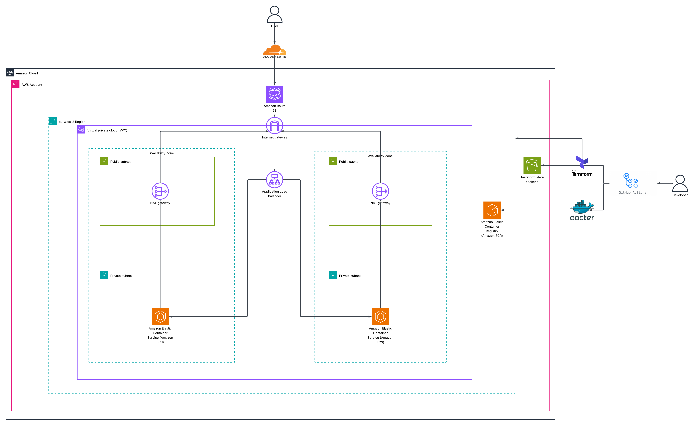
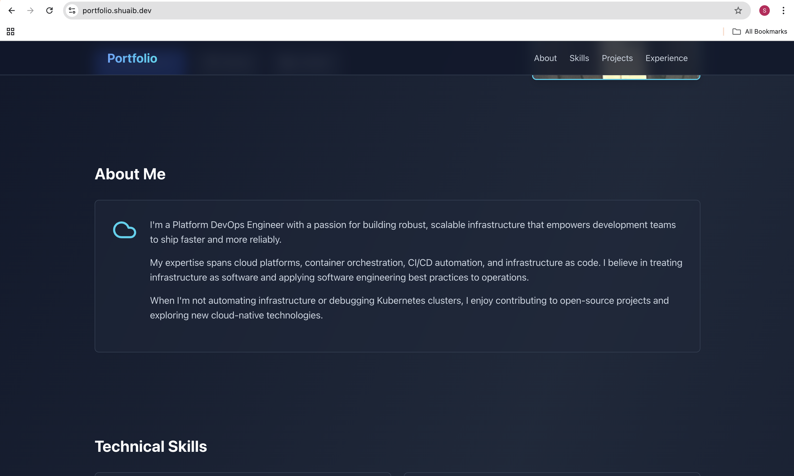
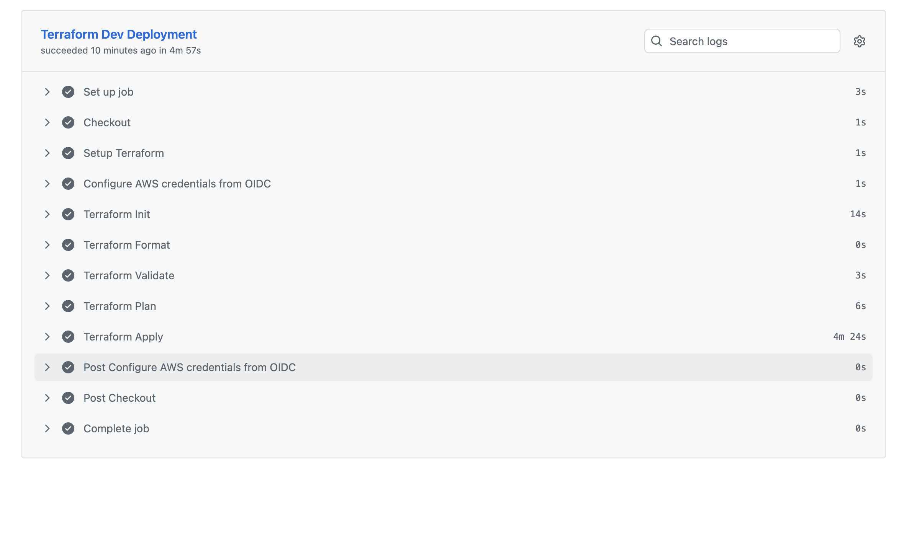
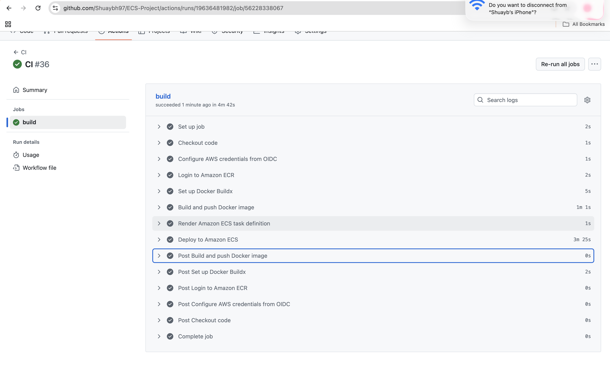

# Portfolio App Deployment on AWS ECS with Terraform

## Overview

This project demonstrates the deployment of a personal portfolio website (built with Next.js, React, and Tailwind CSS) on Amazon ECS using Terraform for infrastructure as code. The setup includes:

- **Frontend**: A responsive portfolio app showcasing skills, projects, and contact information, built with Next.js 14 and styled with Tailwind CSS.
- **Containerization**: The app is containerized using a multi-stage Dockerfile, optimized for production with a non-root user and minimal runtime.
- **CI/CD Pipeline**: GitHub Actions automates building the Docker image, pushing to Amazon ECR, and deploying to ECS on changes to the [`app`](app ) directory.
- **Infrastructure**: Fully provisioned with Terraform, including ECS Fargate cluster, Application Load Balancer (ALB), Route53 for custom domain, and necessary IAM roles.
- **Security**: HTTPS enforced via ALB with ACM certificates, OIDC for AWS authentication in CI/CD, and secure networking with VPC/subnets.
- **Domain**: The app is live at `https://portfolio.shuaib.dev` (replace with your domain).

The project follows best practices for Terraform (modular structure), Docker (multi-stage builds, security), and CI/CD (OIDC, path-based triggers).

## Architecture Diagram


*High-level architecture diagram showing the AWS ECS setup with Terraform.*

## Screenshots
### App Running Live


*Screenshot of the portfolio app running at https://portfolio.shuaib.dev, displaying the main page.*

### CI/CD Pipeline

*Screenshot of Terraform GitHub Actions workflow run.*


*Screenshot of App deployment GitHub Actions workflow run.*

## Instructions to Reproduce the Setup

1. **Clone the Repository**:
   ```bash
   git clone https://github.com/Shuaybh97/ECS-Project.git
   cd ECS-Project
   ```
2. **Set Up Terraform**:
-   Navigate to terraform/bootstrap directory.
-   Update variables.tf with your values (e.g., gihub_repo, state bucket, AWS region).
-   Initialize and apply

    ```bash
    terraform init
    terraform plan 
    terraform apply 
    ```
-   Note the outputs for remote terraform state bucket. 
-   Configure the remote backend for the your terraform state files to the s3 bucket in ./terraform/providers.tf

3. **Configure GitHub Secrets/Variables**:

    In your GitHub repo, add:
    - AWS_ACCOUNT_ID: Your AWS account ID.
    - AWS_REGION: Your deployment region
    - ECS_CLUSTER_NAME: From Terraform output.
    - ECS_SERVICE_NAME: From Terraform output.


4. **Push Code and Trigger CI/CD and Verify Deployment**:

    Make changes to app and push to main or initiate workflow using the manual trigger.
    GitHub Actions will build the image, push to ECR, and deploy to ECS.
    Verify Deployment:

    Check ECS console for running tasks.
    Access the app at your domain (e.g., https://portfolio.shuaib.dev).

5. Download and save task definiton file from Amazon Elastic Container Service Task definitons in your aws account as **task-definition.json** to your app folder to enable future app deployments via CI/CD. 

